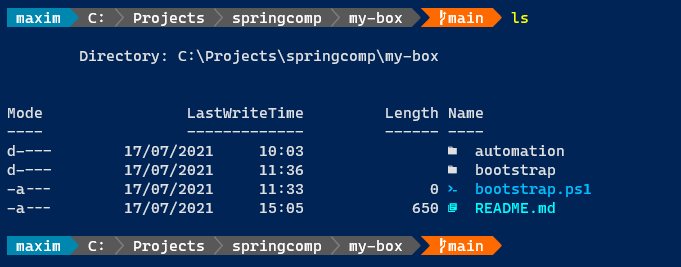

# Overview

This repository contains a set of scripts that helps setting up my development machine.

## PowerShell

My development environment is heavily centered around using the terminal.
From a Windows PowerShell prompt, run the following command:

```pwsh
iex "& { $(irm 'https://raw.githubusercontent.com/springcomp/my-box/main/bootstrap/powershell.ps1') }"
```

This will install:

- PowerShell Core 7.* _daily_ (pwsh).
- [Nerd Fonts](https://www.nerdfonts.com/) modified [Cascadia Code](https://docs.microsoft.com/en-us/windows/terminal/cascadia-code) monospaced font to support prompt customizations like powerline or oh-my-posh.
- [Oh-My-Posh](https://ohmyposh.dev/) PowerShell module.
- [Terminal-Icons](https://github.com/devblackops/Terminal-Icons) PowerShell module.
- [customizations](https://github.com/springcomp/powershell_profile.ps1/blob/master/Microsoft.PowerShell_psreadline-profile.ps1) to [PSReadLine](https://docs.microsoft.com/en-us/powershell/module/psreadline/about/about_psreadline?view=powershell-7.2) PowerShell module.



**Warning**: this script is designed to setup a new machine and installs a custom PowerShell profile. Please backup your existing `$profile` file before running this script.
